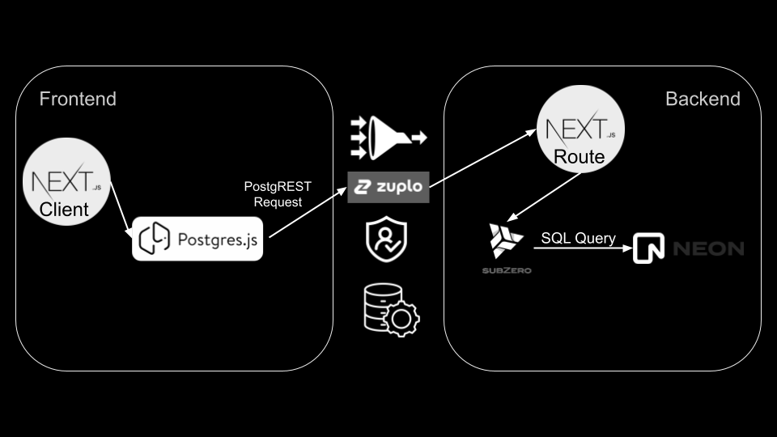

# Neon PostgREST API Demo

Are you using/considering Neo - but wish you had the ability to interact with your database via API/SDK like Supabase? Look no further! This project shows you exactly how to recreate that API and developer experience. [Try the Demo](https://neon-postgrest.zuplopreview.net/).

## Installation

This is just a template so you can clone this repository directly and run it yourself.

First, create a `.env` file and populate `DATABASE_URL` with your Neon database URL. You can find this on the Quickstart tab on the Neon console, under Postgres. Once you have that, procede to installation. `NEXT_PUBLIC_API_URL` will be set to `http://localhost:3000` if you're running locally.

```bash
npm install
```

```bash
npm run dev
```

## How It Works



PostgREST requests are sent from the front-end to a catch-all route which invokes a serverless function. That function translates the request into a SQL query and executes it against your Neon database. The results are returned as a JSON.

NOTE: I wouldn't recommend actually performing SQL queries from your front-end - I bundled this together for demonstration purposes. You are essentially providing a door for malicious actors to interact with your database from your front-end. Instead, I would host the PostgREST API in a separate project (and protected behind a gateway), and call it from CRUD RESTful server functions on this project.

## Tools

I used the following tools:

1. NextJS Serverless Functions for easy Typescript setup + fast runtime (Cloudflare Workers will also work).
2. Vercel to simplify deployment (you can use Cloudflare pages too).
3. `@supabase/postgrest-js` to construct queries using a Supabase-like SDK. This sends PostgREST requests to your serverless function.
4. `@subzerocloud/nodejs` to translate the PostgREST requests into Postgres queries.
5. `@neondatabase/serverless` for querying your Neon database.
6. (optional) [Zuplo](https://zuplo.com) API Gateway to proxy my serverless function. Good place to add caching, rate limiting, DDOS/bot protection, etc so this doesn't blow up in production.

## Why Not Use the App Directory?

I tried for several days to get the `app` directory working for the serverless function but Vercel has wayyy too many unaddressed bugs with bundling wasm (which Subzero needs) and standalone builds for me to keep banging my head on it.
